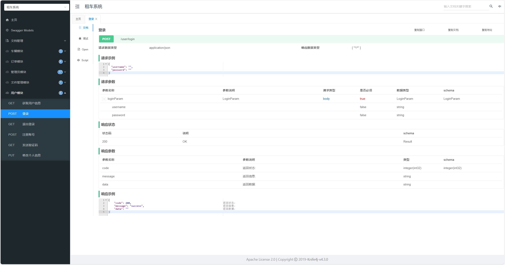
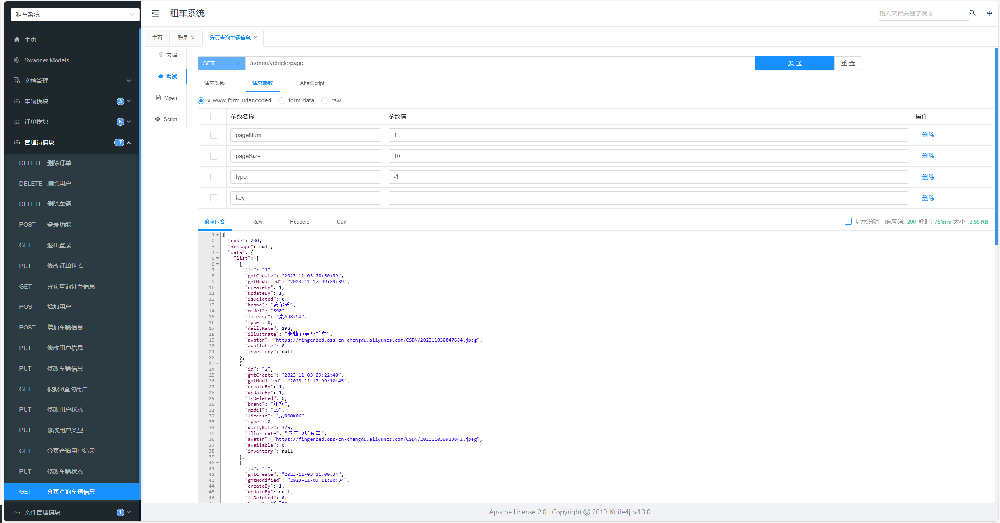

# 租车系统

## 简介
这是一个基于Spring Boot和Vue.js的租车系统，旨在帮助用户方便快捷地租赁车辆，并提供全面的管理功能。用户可以浏览可用车辆，进行预订和支付，管理员可以管理车辆信息、订单、用户信息等。

## 目录
- [简介](#简介)
- [目录](#目录)
- [安装](#安装)
- [运行](#运行)
- [使用说明](#使用说明)
- [文件结构](#文件结构)
- [项目展示](#项目展示)

## 安装

### 系统要求
- 前端：Node.js, npm/yarn
- 后端：Java 17+, Maven

### 前端安装步骤
1. 克隆项目代码：
    ```bash
    git clone https://github.com/OnismExplorer/CarRental.git
    cd CarRental/frontend
    ```
2. 安装依赖：
    ```bash
    npm install  # 或者 yarn install
    ```
### 后端安装步骤
1. 克隆项目代码：
    ```bash
    git clone https://github.com/OnismExplorer/CarRental.git
    ```
2. 安装依赖并构建项目：
    ```bash
    ./mvnw clean install
    ```

## 运行

### 前端运行
在 `/frontend` 目录下：
```bash
npm run serve  # 或者 yarn serve
```

### 后端运行
在项目根目录下：
```bash
./mvnw spring-boot:run
```

## 使用说明
### 用户功能
- 浏览可用车辆
- 预订车辆
- ...
### 管理员功能
- 添加和管理车辆信息
- 查看和管理订单
- 用户管理
- ...

## 文件结构
```csharp
CarRental/
│
│    ── src/          # 源代码
│   ├── pom.xml       # Maven 配置文件
│   └── ...           # 其他后端文件
│
├── frontend/         # 前端代码目录
│   ├── src/          # 源代码
│   ├── public/       # 公共文件
│   ├── package.json  # npm 配置文件
│   └── ...           # 其他前端文件
│
├── README.md         # 项目说明文档
└── ...               # 其他项目文件
```

## 项目展示
### 前端界面展示
前端部分界面展示：
> 登录界面


> 系统首页


> 个人中心


> 租车单车详情页面


### 后端接口
后端部分接口展示：


